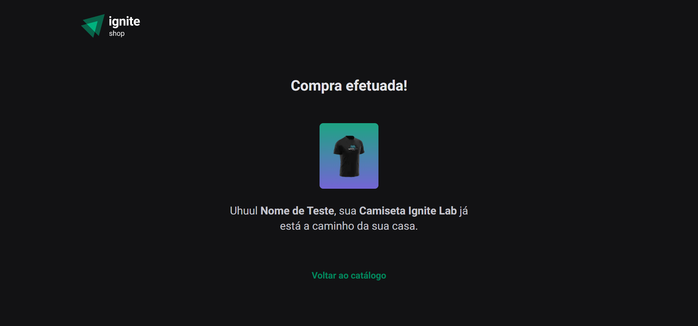

<h1 align="center">
  
</h1>

<h3 align="center">
  Projeto 04: Ignite Shop
</h3>

<blockquote align="center">“Não deixe o medo do fracasso impedir você de tentar.”</blockquote>

<p align="center">
  

  <a href="https://github.com/alleycarvalho/ignite-shop/stargazers">
    
  </a>
</p>

## :rocket: Sobre o projeto

- Uma aplicação que simula uma página de vendas de camisetas integrada ao Stripe para buscar os produtos e realizar o checkout.

---

## :computer: Testar a aplicação

```shell
# Clona o projeto:
git clone https://github.com/alleycarvalho/ignite-shop.git

# Acessa o diretório do projeto:
cd ignite-shop

# Instala dependências:
yarn install

# Adiciona o arquivo ".env.local" e preencha as credenciais do Stripe:
mv .env.example .env.local

# Executa a aplicação:
yarn dev

```

### Acessar o endereço gerado no navegador:
http://localhost:3000/

---

## :mortar_board: Ignite - Projeto 04

### Ferramentas, tecnologias e conceitos utilizados:

- [React](https://react.dev) - Projeto iniciado com [Next.js](https://nextjs.org)
- [Typescript](https://www.typescriptlang.org)
- [EditorConfig](https://editorconfig.org) e [ESLint](https://eslint.org)
- [Stitches](https://stitches.dev) - Biblioteca para estilização de componentes
- [Keen Slider](https://keen-slider.io) - Biblioteca para criar sliders
- [Stripe](https://stripe.com/br) - Infraestrutura de pagamentos para internet
- [Axios](https://axios-http.com/ptbr) - Cliente HTTP baseado em promessas

### Funcionalidades:

- Página com lista de produtos cadastrados no Stripe;
- Pagina do produto com descrição, preço e botão de comprar;
- Redirecionamento para página de checkout do Stripe;
- Redirecionamento e página de compra concluída após checkout;

---

## :computer: Resultado do projeto

### Página inicial do projeto:


### Página do produto:


### Página do checkout:


### Página da compra finalizada:



---

Projeto realizado por <strong>Alley M. Carvalho</strong>

[Rocketseat](https://www.rocketseat.com.br): Ignite - ReactJS - Projeto 04: Ignite Shop
